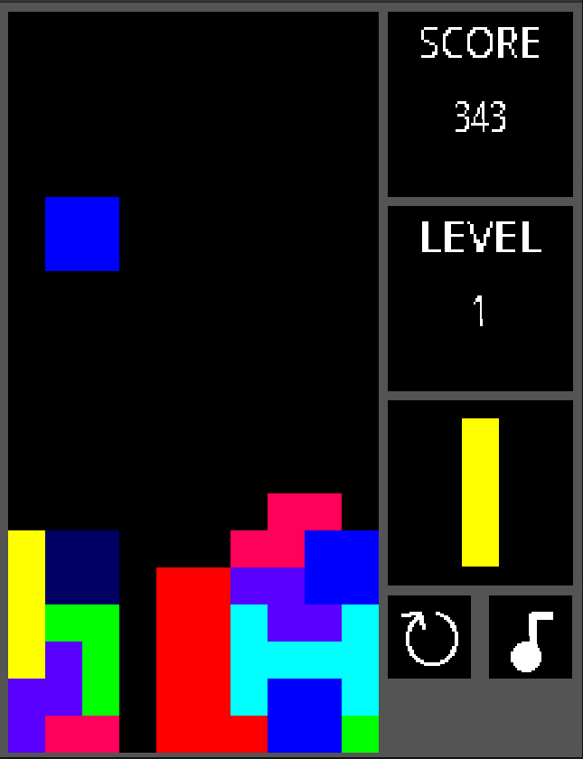

# tetris-collab

Josias and Jacob's super epic Tetris game.



## Gameplay

Like any Tetris game, try to clear fit shapes into rows before they pile up to the top. Victory is impossible.

Keys:
* `right` and `left`: move block
* `down`: speed up descent
* `up`: rotate block
* `space`: drop block
* `r`: restart the game
* `m`: mute or unmute the music

## Building

### Linux

Requirements: `sdl2 sdl2_mixer sdl2_ttf`.

```
$ make
$ ./TETRIS
```

### WASM

Requirements: LLVM and emscripten.

```
$ make wasm
$ make wasm-run
```

`make wasm` will download all of the necessary libraries and compile the program to WASM. The build artifacts are stored in `dist/`, which can be copied to a webserver for distribution.

`make wasm-run` will start a local webserver and open the game in your default browser.

### Windows

Requirements: a better operating system.

Consider compiling it for WASM or tinkering with MinGW.

## Licenses

Open Sans Regular (Sans.ttf) is licensed under the [Apache 2.0 license](https://www.fontsquirrel.com/license/open-sans).

[Korobeiniki](https://en.wikipedia.org/wiki/File:Korobeiniki.mid) (Korobeiniki.wav) is in the public domain.

Code is licensed under the GNU General Public License version 3, or, at your option, any later version.
